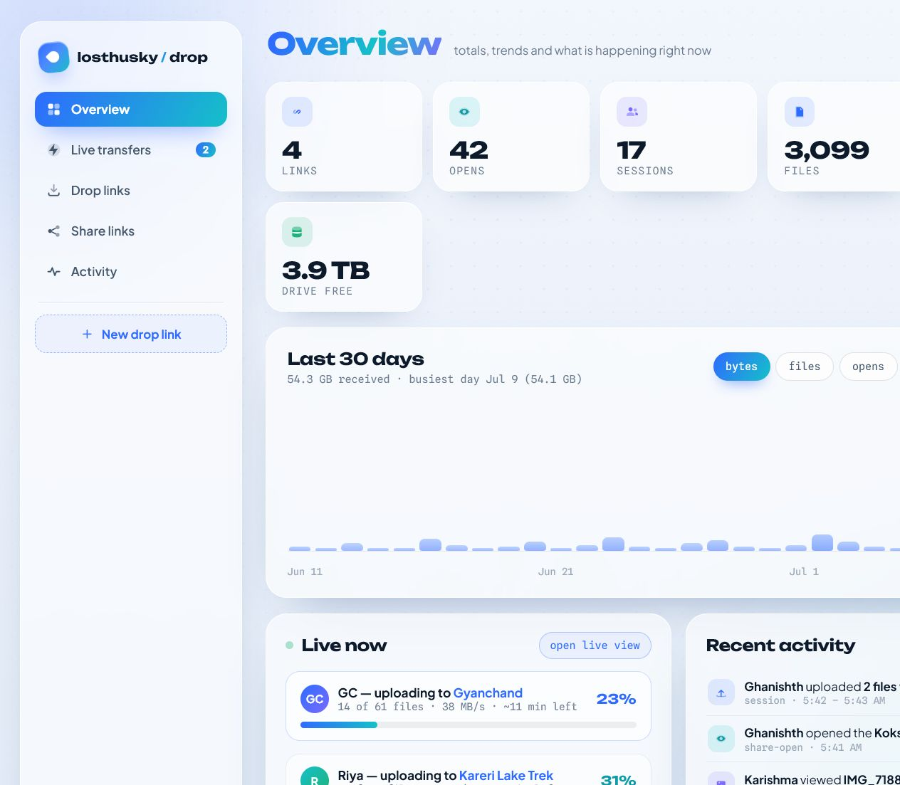
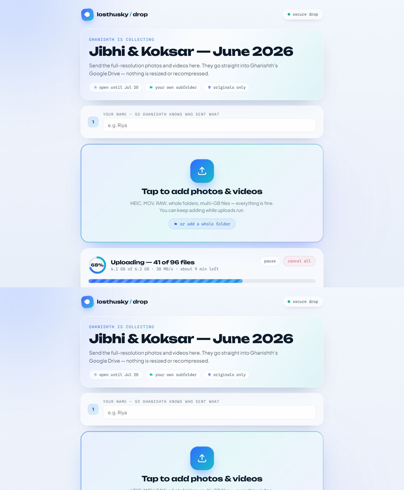
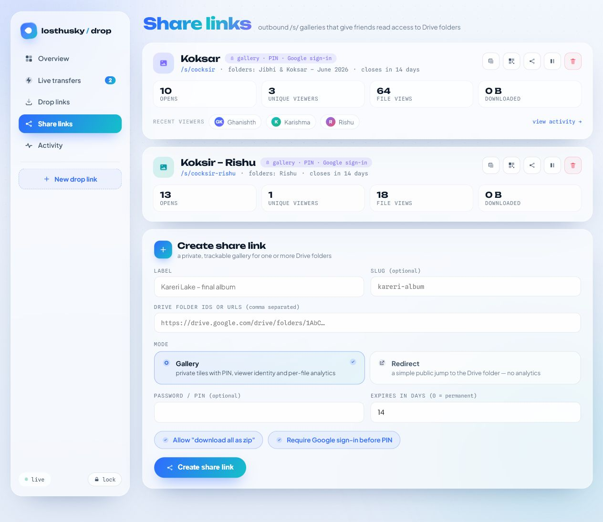
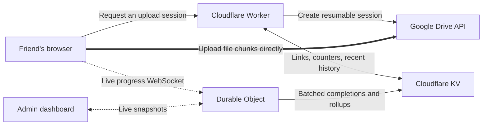

<p align="center">
  
</p>

<h1 align="center">Husky Drop</h1>

<p align="center">
  <strong>A private, direct-to-Google-Drive dropbox for original photos, videos, and large files.</strong>
  <br />
  Send a link. Friends upload from any browser. You watch the transfer live.
</p>

<p align="center">
  <a href="https://dropbox.losthusky.qzz.io/"></a>
  
  
  
  
</p>

Husky Drop is a receive-and-share system for the files that group chats, email attachments, and compressed social uploads handle badly. It combines a friendly public uploader, a real-time operations dashboard, and private Drive-backed galleries in one Cloudflare Worker application.

File bytes move from the browser directly to Google Drive through resumable upload sessions. The Worker validates access, mints those sessions, records compact metadata, and coordinates live state—it does not proxy incoming file bytes.

> [!NOTE]
> This is a focused personal-cloud project, not a multi-tenant file-hosting SaaS. It is designed for a trusted owner collecting from invited people.

## See it in action

<p align="center">
  
</p>

<table>
  <tr>
    <td width="50%" valign="top">
      
      <br /><strong>For uploaders</strong><br />A clear, phone-friendly flow for originals, whole folders, huge files, pause, cancel, retry, and resume.
    </td>
    <td width="50%" valign="top">
      
      <br /><strong>For collectors</strong><br />Private galleries or Drive redirects with PINs, viewer attribution, analytics, ZIP delivery, pause, and expiry.
    </td>
  </tr>
</table>

<sub>Interface previews are rendered from the checked-in redesign package with demonstration data.</sub>

## Why Husky Drop

| | Capability | What makes it useful |
| --- | --- | --- |
| ⚡ | **Direct-to-Drive uploads** | Incoming chunks go to Google's resumable-upload endpoint instead of being relayed through a Worker. |
| 🔁 | **Real recovery** | Interrupted sessions are stored in IndexedDB; re-selecting the same file resumes from Drive's confirmed byte offset. |
| 🧠 | **Adaptive transfer engine** | Automatic mode adjusts between 2–8 parallel files, grows or shrinks chunks, prewarms sessions, detects stalls, and backs off after errors. |
| 📡 | **Live command center** | Durable Object WebSockets stream active uploaders, file progress, throughput, ETA, and recent completions to the admin. |
| 🖼️ | **Private share galleries** | Share existing Drive folders through PIN-capable galleries with thumbnails, media viewing, signed downloads, and streaming ZIP64 archives. |
| 🧯 | **Abuse containment** | Link budgets, expiry, pause controls, Drive-space checks, brute-force damping, and signed short-lived download tokens limit damage. |
| 🗂️ | **Drive-native organization** | Choose a destination in the Drive browser, create per-uploader folders, or preserve uploaded relative paths in metadata. |
| 🎨 | **Per-link presentation** | Labels, welcome copy, colors, backgrounds, logos, promo media, and calls to action can be configured per drop. |

### One application, three experiences

- **Drop links** — private `/d/:slug` receive-only pages for originals and large batches.
- **Admin** — one `/admin` shell with Overview, Live transfers, Drop links, Share links, Activity, link details, and New drop link flows.
- **Share links** — `/s/:slug` galleries for controlled read access, plus redirect mode when a public Drive handoff is intentional.

## How it works



The Worker is the control plane:

1. It validates the link, expiry, pause state, budgets, Drive headroom, and optional PIN.
2. It asks Google Drive for a file-scoped resumable upload URL.
3. The browser sends chunks to Google and reports compact live progress over a WebSocket.
4. The Durable Object reconciles live sessions, derives throughput and ETA, batches completion writes, and stores daily SQLite rollups.
5. Google Drive remains the durable source of file truth; the app keeps only the metadata needed for operation and analytics.

### Transfer behavior

- Automatic or fixed parallelism from 1–8 active files.
- 8–128 MB adaptive chunks, always aligned to Drive's required upload granularity.
- Exponential retry, dead-session replacement, and a 60-second no-progress watchdog.
- Two prefetched Drive sessions to reduce gaps between files.
- Bounded DOM rendering and constant-time aggregate counters for 600+ file queues.
- Resume records kept locally for roughly six days; the uploader must re-select files because browsers cannot silently reopen local files.

For the deeper write-path and state model, read [Architecture](docs/ARCHITECTURE.md). What changed and why, newest first: [Changelog](docs/CHANGELOG.md).

## Security model

Husky Drop assumes a private owner account and invitation links that can still leak. Its controls focus on credential safety, guessing resistance, spam containment, and keeping Drive identifiers out of public APIs.

| Control | Implementation |
| --- | --- |
| PIN storage | PBKDF2-SHA256, 100,000 iterations, unique salt, constant-time comparison, and transparent migration of legacy hashes. |
| Guessing protection | Per-IP exponential lockouts plus per-link global damping for distributed attempts. |
| Admin access | HMAC-signed, HttpOnly, Secure, SameSite=Strict session cookie; optional allow-listed Google sign-in; bearer token retained for scripts. |
| Admin mutations | Same-origin checks and rate-limited login. |
| Gallery downloads | HMAC-signed tokens bound to scope, share, file, and expiry; risky executable/archive source types are blocked from public delivery. |
| Capacity protection | Link-level byte, file, and session budgets; manual pause; automatic pause at a limit; 5 GB Drive quota reserve. |
| Secret handling | Worker secrets or local `.dev.vars`; both are kept out of Git. Public metadata never exposes Drive folder IDs or PIN hashes. |

The direct upload path is a performance and exposure reduction—not end-to-end encryption. Google still receives and stores the uploaded files. Antivirus scanning, Turnstile, and reduced `drive.file` OAuth scope are not implemented. See the complete [Security model](docs/SECURITY.md) before exposing a deployment broadly.

## Stack

| Layer | Technology |
| --- | --- |
| Edge application | Cloudflare Workers |
| Static application | Worker Assets, semantic HTML, CSS, vanilla JavaScript |
| Durable live state | Cloudflare Durable Objects + WebSockets |
| Rollups | Durable Object SQLite |
| Persistent metadata | Cloudflare KV |
| File storage | Google Drive resumable uploads |
| Authentication | PBKDF2 PINs, HMAC sessions/tokens, optional Google OAuth |
| Notifications | Optional Resend email digests |
| Media experience | PhotoSwipe, Swiper, native media, streaming ZIP64 |
| Validation | Node.js smoke, structure, icon, workflow, and README tests |

There is no frontend framework, application bundler, database server, or file-storage proxy to operate.

## Quick start

### Prerequisites

- A current Node.js LTS release and npm.
- A Cloudflare account with Workers, KV, and Durable Objects available.
- A Google Cloud project with the Google Drive API enabled.
- A Google OAuth web client and refresh token for the Drive account that will receive files.
- A hostname for the Worker if you want a custom domain.

### Preview a share gallery without production services

For isolated share-gallery work, use the local-only fixture server:

```bash
npm run dev:fixtures
# http://127.0.0.1:8788/s/local-media
```

The fixture server:

- Serves the real browser UI with synthetic local images and videos.
- Requires no Cloudflare account, Google token, KV namespace, `.dev.vars`, or live share.
- Never contacts Cloudflare KV, Google Drive, or production analytics.
- Adds a fixture-only CSP that blocks every off-origin browser request; fallback system fonts are expected locally.
- Supports real byte-range responses so video seeking can be tested.
- Is the default command for isolated share-gallery work; `npm run dev` uses Wrangler and the developer's configured bindings.

### 1. Install and create safe local configuration

```bash
git clone https://github.com/DhakadG/husky-drop.git
cd husky-drop
npm install
cp wrangler.example.jsonc wrangler.jsonc
npx wrangler kv namespace create KV
```

On PowerShell, use `Copy-Item wrangler.example.jsonc wrangler.jsonc`. Put the new KV namespace ID, route, owner display name, and optional parent Drive folder in your local `wrangler.jsonc`.

### 2. Create a Google refresh token

Add `http://localhost:8765/cb` as an authorized redirect URI on your Google OAuth client, then run:

```bash
node scripts/get-refresh-token.mjs YOUR_GOOGLE_CLIENT_ID YOUR_GOOGLE_CLIENT_SECRET
```

### 3. Add required secrets

```bash
npx wrangler secret put GOOGLE_CLIENT_ID
npx wrangler secret put GOOGLE_CLIENT_SECRET
npx wrangler secret put GOOGLE_REFRESH_TOKEN
npx wrangler secret put ADMIN_TOKEN
```

Recommended for separate signing and passwordless admin access:

```bash
npx wrangler secret put SHARE_SIGNING_KEY
npx wrangler secret put ADMIN_EMAIL
```

If `ADMIN_EMAIL` is configured, add `https://YOUR_HOST/api/admin/auth/callback` to the Google OAuth client's redirect URIs.

### 4. Validate and run locally

```bash
npm test
npm run dev
```

For local API calls, create an ignored `.dev.vars` file containing the same required secrets. The full guided checklist is in [Setup required](docs/SETUP-REQUIRED.md).

## Configuration

### Worker bindings

| Binding | Required | Purpose |
| --- | :---: | --- |
| `ASSETS` | Yes | Serves the application in `public/`. |
| `KV` | Yes | Stores links, stats, events, recent history, guards, and cached Drive metadata. |
| `LIVE_TRACKER` | Yes | Durable Object for WebSockets, batching, rate limits, and SQLite rollups. |

### Secrets

| Name | Required | Purpose |
| --- | :---: | --- |
| `GOOGLE_CLIENT_ID` | Yes | Google OAuth client identifier. |
| `GOOGLE_CLIENT_SECRET` | Yes | Google OAuth client secret. |
| `GOOGLE_REFRESH_TOKEN` | Yes | Refresh token for the receiving Drive account. |
| `ADMIN_TOKEN` | Yes | Admin bootstrap login and signing-key fallback. |
| `SHARE_SIGNING_KEY` | Recommended | Dedicated key for share downloads, ZIP tickets, and viewer sessions. |
| `ADMIN_EMAIL` | Optional | Exact Google account allowed to sign in to `/admin`. |
| `RESEND_API_KEY` | Optional | Enables upload-start and session-digest email notifications. |
| `NOTIFY_TO` / `NOTIFY_FROM` | Optional | Notification recipient and verified sender used with Resend. |

### Non-secret variables

| Name | Purpose |
| --- | --- |
| `DRIVE_PARENT_ID` | Parent folder under which automatically created drop folders live. Leave empty for My Drive root. |
| `OWNER_DISPLAY_NAME` | Public collector name shown on drop pages. |
| `LINK_SLUGS` | Optional recovery/fast-path list of existing drop slugs. |
| `CF_BEACON_TOKEN` | Optional Cloudflare Web Analytics token injected into HTML. |
| `CLARITY_PROJECT_ID` | Optional Microsoft Clarity project identifier injected into HTML. |

## Project map

```text
husky-drop/
├── src/
│   ├── worker.js         # router, page serving, admin auth, live sockets
│   ├── drop-api.js       # public drop endpoints: sessions, progress, completions
│   ├── admin-api.js      # admin drop-link CRUD, overview, cleanup
│   ├── auth.js           # Google sign-in and admin session cookies
│   ├── drive.js          # Drive OAuth, folders, quota, file metadata
│   ├── live.js           # Durable Object: sessions, hibernatable WebSockets
│   ├── live-analytics.js # DO SQLite: rollups, telemetry, activity, share stats
│   ├── live-digest.js    # per-session finished-upload email
│   ├── live-completions.js # batched KV flush of Drive-verified completions
│   ├── share.js          # public share endpoints: meta, listing, tracking
│   ├── share-admin.js    # share CRUD + Drive permission revocation
│   ├── share-token.js    # signed download tokens, download safety list
│   ├── share-media.js    # thumbnails, Range downloads, on-demand EXIF
│   ├── share-zip.js      # streaming ZIP64 "download all"
│   ├── store.js          # KV events, counters, lockouts, notifications
│   └── util.js           # normalizers, security helpers, constants
├── public/             # home, admin, drop, share, legal pages and assets
├── scripts/            # OAuth helper and automated test suites
├── test/dev-fixtures/  # synthetic local-only test media
├── docs/               # architecture, API, security, setup, deployment
├── wrangler.example.jsonc
└── package.json
```

## Testing

```bash
npm run test:fixtures
npm test
```

The test chain covers Worker behavior, authentication and security headers, Drive and share flows, UI structure, icon fidelity, admin workflows, adaptive concurrency, README claims, and local asset/link integrity.

For a deploy-shaped build without publishing:

```bash
npx wrangler deploy --dry-run
```

## Deployment

GitHub and Cloudflare are independent release targets. Ship in this order:

```bash
# 1. verify
npm test

# 2. update source history
git add -A
git commit -m "describe the change"
git push origin main

# 3. publish the Worker and static assets
npm run deploy
```

`git push` does not update the live Worker, and `wrangler deploy` does not update GitHub. Read [Deploy workflow](docs/DEPLOY.md) before shipping.

## Documentation

| Document | Use it for |
| --- | --- |
| [Setup required](docs/SETUP-REQUIRED.md) | First deployment and post-upgrade checklist. |
| [Deploy workflow](docs/DEPLOY.md) | Safe GitHub → Cloudflare release order. |
| [Architecture](docs/ARCHITECTURE.md) | Data path, Durable Object state, batching, recovery, and performance. |
| [Security](docs/SECURITY.md) | Threat model, lockouts, authentication, budgets, and non-goals. |
| [API reference](docs/API.md) | Public and admin HTTP/WebSocket endpoints. |
| [Email notifications](docs/EMAIL.md) | Optional Resend setup and delivery behavior. |
| [GitHub setup](docs/GITHUB.md) | Files to commit and files that must remain local. |

## Known limits

- This is a single-owner personal service, not an isolated multi-tenant platform.
- Upload recovery requires the sender to re-select the same local files; browsers do not let a page reopen files silently.
- Gallery safety filtering is metadata-based and is not malware scanning.
- Redirect-mode share links grant anyone-with-the-link Drive reader access while active; use gallery mode for private material.
- Drive OAuth currently uses a broad Drive scope; a reduced `drive.file` migration is future hardening work.
- Turnstile and client-side file encryption are not implemented.
- Active transfer state is ephemeral if the Durable Object restarts, but Google-owned resumable uploads continue and completed files remain in Drive.

---

<p align="center">
  Built for the moment after a trip when everyone has the originals—and nobody wants another compressed group-chat upload.
</p>
