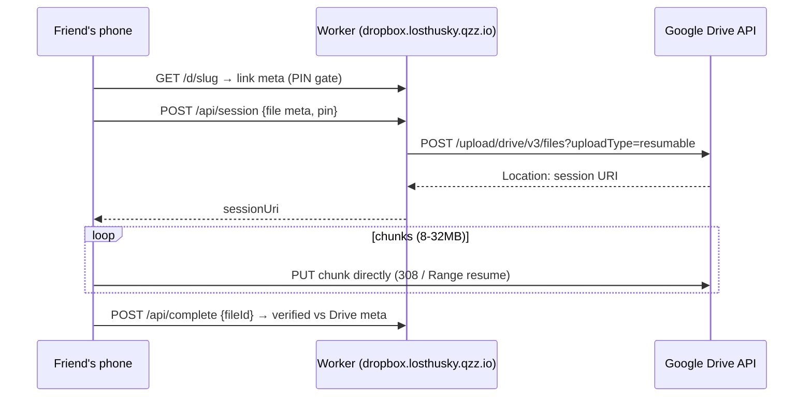
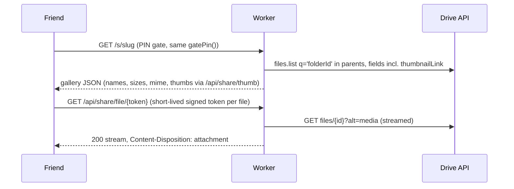

# 03 — Direct-Drop hardening + Share Links (outbound) design

## 1. Reality check: you already built "Direct-Drop"

The prompt asked for "a plan for Drop Links — secure temporary URLs where guests upload directly to a chosen GDrive folder." **That is exactly what `/d/:slug` already is**, and its byte path (browser → `googleapis.com` resumable session, Worker never touches file bytes) is the correct one. So this doc covers (§2) hardening the existing drop links, (§3) the missing half — Share Links that give friends read access to Drive folders you choose, and (§4) resume-after-reload.

Current drop flow (keep):



## 2. Drop-link hardening (Phase 1)

1. **Fix the 4 `request` ReferenceErrors** (00 §bugs) — first-session 500s and dead global damping live here.
2. **`disabled` flag** on links (pause without delete) — 02 §B.
3. **Per-link budget**: `settings.maxTotalBytes` (e.g. 400 GB) and `maxTotalFiles`; enforce in `createSession` by reading `stats:{slug}` (already fetched patterns exist). Prevents a leaked link from filling your Drive. On breach → 403 `link budget reached`, event logged, link auto-disables.
4. **PIN → PBKDF2** (04 §1.3).
5. **Uploader allow-list (optional per link)**: `settings.uploaderNames: ["priya","arjun"]` — if set, the name field must match one (case-insensitive) or session minting fails. Lightweight "only my 6 friends" gate that survives link forwarding.
6. **One-time / N-use links**: `settings.maxSessions` — count sessions in stats; when reached, link auto-pauses. (t.zip has nothing like this; it's cheap for you.)
7. **Drive quota preflight**: cache `about.get(storageQuota)` 1h; refuse sessions when projected usage > quota − 5 GB, and show remaining space on the drop page.

## 3. Share Links — give friends read access to chosen Drive folders

### 3.1 Two modes (build both; they share the link object)

| Mode | How | Pros | Cons |
|---|---|---|---|
| **A. Redirect mode** | Worker grants Drive permission `{type:"anyone", role:"reader"}` on the folder, then 302 → `drive.google.com/drive/folders/{id}` | 5 lines of code; Drive UI does browsing, preview, zip-download | Folder becomes anyone-with-link; Google link can be re-shared forever unless you revoke; no PIN, no analytics after redirect |
| **B. Gallery mode (recommended default)** | Folder stays private. Worker lists folder via Drive API and serves your own gallery page; file bytes streamed through the Worker (or via short-lived signed proxy URLs) | Folder stays private; PIN + expiry + revoke actually enforced; view/download analytics; your branding; HEIC preview later | Downloads proxy through Worker (fine: CF has no egress fees; but each download = 1 request + streaming time) |

Mode A implementation sketch (also used for "open in Drive" button inside Mode B):

```js
// grant on create (store permissionId), revoke on link delete/expiry
const r = await fetch(`https://www.googleapis.com/drive/v3/files/${folderId}/permissions?supportsAllDrives=true`, {
  method: "POST", headers: authJson(tok),
  body: JSON.stringify({ type: "anyone", role: "reader" }),
}); // -> { id: permissionId }  ... later: DELETE /permissions/{permissionId}
```
A scheduled Worker (cron trigger, free) revokes permissions for expired redirect links — this makes "temporary Google access" real.

### 3.2 Share-link object (KV `share:{slug}`)

```js
{
  slug, label,
  mode: "gallery" | "redirect",
  folderIds: ["...", "..."],        // one or more folders chosen at creation
  pinSalt, pinHash,                  // PBKDF2, same gate as drop links
  expiresAt, disabled: false,
  permissionIds: { folderId: permId }, // redirect mode bookkeeping
  allowZip: true,                    // client-side zip of selected files
  theme: {...},                      // reuse normalizeTheme
  createdAt
}
```
Admin creation UI: reuse the existing Drive folder picker pattern (`driveFindFolder` by name, or paste folder ID / Drive URL — parse the ID out of the URL).

### 3.3 Gallery mode flow


- Thumbnails: `thumbnailLink` URLs are short-lived and cookie-free — proxy them (`/api/share/thumb/:fileId`) with `cache-control: private, max-age=3600` so the gallery is fast and Drive stays hidden.
- Streaming: `return new Response(driveResp.body, {...})` — the Worker streams without buffering; 10 ms CPU limit applies to CPU, not stream time. Multi-GB files are fine.
- Pagination: `pageSize=100` + `nextPageToken`; gallery lazy-loads.
- "Download all": client-side streaming zip (e.g. `client-zip`, ~3 kB, vendored) pulling each file through the proxy — no server zip needed. Cap advice in UI (>10 GB → "use Open in Drive instead").

### 3.4 Signed download tokens (adapting t.zip's scoped-JWT idea)

Never expose raw fileIds as durable URLs. Mint HMAC tokens bound to slug+file+expiry:

```js
async function signShareToken(env, slug, fileId, ttlSec = 600) {
  const exp = Math.floor(Date.now() / 1000) + ttlSec;
  const body = `${slug}.${fileId}.${exp}`;
  const key = await crypto.subtle.importKey("raw", new TextEncoder().encode(env.SHARE_SIGNING_KEY),
    { name: "HMAC", hash: "SHA-256" }, false, ["sign"]);
  const mac = b64url(await crypto.subtle.sign("HMAC", key, new TextEncoder().encode(body)));
  return `${b64url(body)}.${mac}`;
}
// verify: recompute, timingSafeEqual, check exp, check slug still active + PIN session cookie
```
Add secret: `wrangler secret put SHARE_SIGNING_KEY`.

### 3.5 Share-link analytics
Log `share-open`, `share-download {file, bytes}`, `share-zip` through the same DO-batched event pipeline (04 §3). Dashboard shows opens/downloads per share link — this is where t.zip's `views[]/downloads[]` idea lands in your stack.

## 4. Resume-after-reload for drop links (Phase 2)

State to persist (IndexedDB `husky-pending`, per slug):
```js
{ sessionId, files: [{ name, size, lastModified, sessionUri, sentApprox, fileId|null }] }
```
Flow:
1. On `ensureSession` success → save record. On file done (`fileId` set + complete logged) → remove record. Throttle writes (once per file state change, not per chunk).
2. On page load, if records exist and are <6 days old → banner: "You have an unfinished upload (23 files). Re-select the same files to resume."
3. On re-pick, match by `name+size+lastModified` → `probeOffset(sessionUri)`:
   - `308 + Range` → resume from offset (bytes already in Drive are NOT re-sent — this is the whole win);
   - `200/201` → file actually finished; just `finalizeComplete`;
   - `404/410` → session dead; re-mint and restart that file.
4. Unmatched records older than 7 days are purged.
Limitation to document in UI: browsers can't reopen files without a re-pick; matching makes the re-pick painless (select-all of the same gallery selection works).

## 5. What NOT to change

- Do not route upload bytes through the Worker to "add checks" — you'd hit CF request-size/CPU limits and destroy the design's main advantage.
- Do not adopt tus for drop links; Drive resumable is equivalent here and costs nothing.
- Keep DO-batched KV writes; extend the same batching to all new event types.
