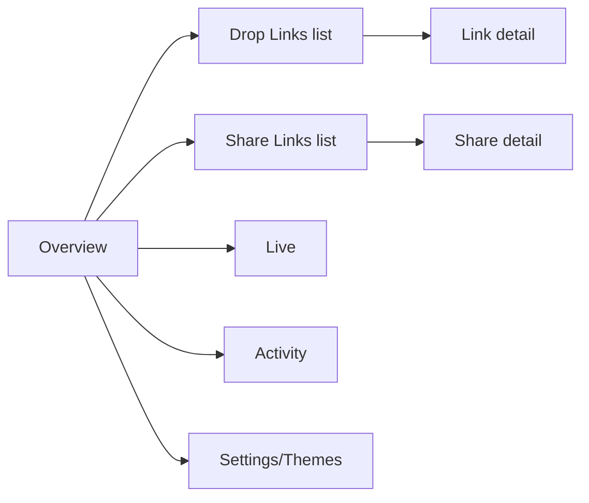

# 05 — Dashboard & UX Overhaul Blueprint

Goal: move from "basic totals + tables" to an analytics dashboard, while keeping the zero-dependency vanilla-JS approach that makes the current admin fast. You already have strong bones others lack (live WS view, keyed DOM reconciliation, event feed with OS/geo). This plan builds on them and folds in the `docs/Personal Dropbox UI Redesign/husky-drop-2.0` mockups.

## 1. Information architecture



- **Overview** (default): headline KPIs, 30-day activity chart, live-now strip, latest activity, links needing attention (expiring soon, budget nearly used, paused).
- **Drop Links / Share Links**: two tabs of the same list pattern (t.zip splits TransferList vs TransferRequestList the same way).
- **Link detail**: stats header → chart → live → history → settings fold (current structure is right; upgrade content).
- **Activity**: full event feed w/ filters (type, link, uploader) — data already exists.

## 2. Overview page spec

KPI cards (existing `upsertCards` — keep):
`Total received` (bytes), `Files`, `Uploaders (30d, unique names)`, `Active now`, `Drive free space` (new: `about.get` cached 1h — the number you actually care about).

**30-day chart** — the big upgrade t.zip's timestamped stats point at, powered by the `day_stats` rollup table (04 §3):
- API: `GET /api/admin/timeseries?days=30` → `[{day, opens, sessions, files, bytes}]` (one DO SQLite query).
- Render: no chart library needed — inline SVG bars/area, ~60 lines, CSP-clean:

```js
function sparkArea(el, points, w = 600, h = 120) {
  const max = Math.max(...points.map(p => p.v), 1);
  const step = w / Math.max(points.length - 1, 1);
  const d = points.map((p, i) =>
    `${i ? "L" : "M"}${(i * step).toFixed(1)},${(h - (p.v / max) * (h - 10)).toFixed(1)}`).join(" ");
  el.innerHTML = `<svg viewBox="0 0 ${w} ${h}" preserveAspectRatio="none">
    <path d="${d} L${w},${h} L0,${h} Z" class="area"/><path d="${d}" class="line"/></svg>`;
}
```
- Toggle: bytes / files / opens. Hover tooltip via `<title>` per point (cheap) or a tracked vertical rule (nicer).

**Attention row** (new): chips like `kareri-lake-trek · 82% of budget`, `goa-2026 · expires in 2d`, `beach-drop · paused` — computed client-side from the links payload.

## 3. Link detail upgrades

- Per-link sparkline (same `day_stats`, filtered by slug).
- **Uploader leaderboard**: aggregate `recent:` history by uploader → `Priya 214 files · 18 GB` with per-uploader folder deep-link into Drive. Trip-social gold; nothing in t.zip has it.
- **File-type breakdown**: donut (SVG) of images/videos/other by bytes, from mime in history rows.
- History table: add type icon, thumbnail hover (existing `/api/admin/thumb/` — currently fetched but only `webViewLink` used; render `thumbnailLink` as an actual 48px preview img via proxy), sort by size/date, uploader filter.
- **QR + share block**: QR code, copy button, `navigator.share`, and a WhatsApp-prefilled `https://wa.me/?text=` share shortcut (how links realistically reach your friends).
- Budget bar: `used / maxTotalBytes` progress with auto-pause marker.

## 4. Live view upgrades (already your best feature)

- Per-session sparkline of speed (keep last ~60 speed samples in DO session object — memory only, no storage).
- Session timeline: `started 14:02 · 3.1 GB/9.8 GB · ETA 12m · Android · Jaipur, IN` (you already collect OS/geo in events; copy into live session at `session-start`).
- Notification opt-in: `Notification.requestPermission()` in admin; DO already pushes via WS — fire a browser notification on `start` and on `done` (per-link toggle). Free replacement for email-per-event.

## 5. Guest drop page polish (friends' side)

- Adopt the husky-drop-2.0 mockup visual language (already in `docs/`), keep the existing performance engineering (bounded rows, wake lock).
- Add: per-uploader recap screen after completion — "You sent 214 files · 18.2 GB ✓ All safe in Ghanishth's Drive" + confetti; screenshot-friendly (friends will post it in the group chat — free virality for the next trip).
- Add: "resume interrupted upload" banner (03 §4).
- Add: file-count/size preview + duplicate detection before upload starts (`name+size` vs this session's already-queued list).
- Add: "Report a problem" → `/api/client-error` (02 §G).
- i18n-lite: strings in one object; Hindi + English toggle if your group wants it.

## 6. Share-link gallery page (new, see 03 §3.3)

Layout: masonry thumb grid (CSS columns; no JS lib), lightbox preview (native `<dialog>`), select-mode → "Download selected (zip)" client-side, "Open in Drive" (redirect-mode grant) as the escape hatch for huge pulls. PIN gate reuses the drop page's component/styles.

## 7. Theming: from per-link blobs to reusable profiles (t.zip BrandProfiles, adapted)

- KV `theme:{name}` documents with the existing `normalizeTheme` shape; link stores `themeRef` OR inline theme (backward compatible: resolve ref → merge inline overrides).
- Admin "Themes" tab: CRUD + live preview iframe of the drop page with `?preview-theme=name` (admin-only query param).
- Image assets: no S3 — either external HTTPS URLs (current approach) or small data-URIs stored in the theme doc (cap 100 KB, logos only).

## 8. Implementation notes for the coding model

- Keep vanilla JS + the existing `reconcile()/upsertCards()` helpers; no framework, no bundler, no CDN scripts (CSP stays `script-src 'self'`).
- Split `admin.js` (740 lines) into modules served as ES modules: `admin/core.js` (auth+fetch), `admin/live.js`, `admin/links.js`, `admin/charts.js`, `admin/detail.js`. `<script type=module>` keeps CSP happy.
- Every new endpoint returns in one round-trip what a view needs (overview already does this — keep the pattern; avoid t.zip's request-waterfall dashboard).
- Dark theme stays default; ensure WCAG AA contrast for the accent-on-dark chips.
